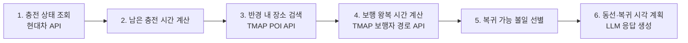

# VoltGo ⚡🚶

> **전기차 충전 대기시간 활용 에이전트**
> 충전이 끝나기 전에 다녀올 수 있는 식사·쇼핑 등 볼일을 골라, 이동 동선과 복귀 시각을 계획해 주는 AI 에이전트

> 🛠️ **현재 상태: 기본 구현(뼈대) 완료** — Mock 데이터로 `충전 조회 → 시간 예산 → 장소 검색 → 왕복 경로 → 선별 → 승인/확정 → 선호 기억` 전체 흐름이 돌아갑니다. TMAP 은 키를 넣으면 실연동, 현대차는 Mock 이 기본입니다. 설계서는 `설계서/VoltGo_Agent_설계서_완성본.docx`.

---

## 1. 개요

| 항목 | 내용 |
| --- | --- |
| **정의** | 충전이 끝나기 전 다녀올 수 있는 식사·쇼핑 등 볼일을 골라, 이동 동선과 복귀 시간을 계획하는 AI 에이전트 |
| **타깃** | 전기차 운전자 |
| **문제** | 충전 30~40분 동안 무엇을 할 수 있는지, 언제까지 돌아와야 하는지 매번 직접 계산해야 함 |
| **솔루션** | 충전 상태 조회 → 목표 충전까지 남은 시간 → 반경 내 장소 검색 → 보행 왕복 시간 계산 → 남은 시간 안에 복귀 가능한 볼일 선별 → 동선·복귀 시각 계획 |

## 2. 문제 정의 (Business Understanding)

- 급속 충전은 보통 **30~40분** 소요되지만, 운전자는 그 시간을 어떻게 쓸지 매번 즉흥적으로 판단한다.
- 운전자가 직접 따져야 하는 것:
  - 목표 충전량(예: 80%)까지 **정확히 몇 분** 남았는가?
  - 주변에 **걸어서 갈 수 있는** 식당·카페·편의점·마트는 어디인가?
  - 다녀오는 데 **왕복 몇 분**이 걸리고, 볼일 보는 시간을 더하면 **충전 완료 전에 복귀**할 수 있는가?
- 충전 완료 후에도 차량을 방치하면 **충전기 점유(유휴) 요금** 부과 및 다른 운전자의 불편으로 이어진다.

### 목표

- 사용자가 "뭐 할까?"라고 묻기만 하면, **복귀 가능한 볼일 후보 + 동선 + 복귀 시각**을 제시한다.
- 시간 계산(남은 충전 시간, 보행 왕복 시간)은 LLM 추론이 아닌 **코드로 정확하게** 계산한다.

## 3. 사용 시나리오 (예시)

```
사용자: 지금 충전 중인데 30분 동안 뭐 하지? 밥 먹고 싶어.

에이전트:
  현재 배터리 42% → 목표 80%까지 약 34분 남았어요. (완료 예정 14:34)
  여유 버퍼 5분을 제외하면 사용 가능한 시간은 약 29분입니다.

  추천 1) OO김밥 — 도보 편도 4분, 식사 약 15분 → 14:23 복귀 (여유 11분)
  추천 2) △△편의점 + 카페 — 도보 편도 6분, 약 12분 → 14:24 복귀
  ✗ □□국밥 — 도보 편도 12분, 복귀 불가 (완료 시각 초과)

  👉 14:29까지는 출발 지점으로 돌아오세요.
```

## 4. 처리 흐름 (파이프라인 설계)



| 단계 | 입력 | 출력 | 담당 |
| --- | --- | --- | --- |
| 1. 충전 상태 조회 | 차량 ID | 현재 SoC(%), 충전 전력(kW), 차량 위치 | 현대차 API (또는 Mock) |
| 2. 남은 시간 계산 | 현재 SoC, 목표 SoC, 배터리 용량, 충전 전력 | 충전 완료 예정 시각 | 코드 (결정적 계산) |
| 3. 장소 검색 | 차량 위치, 반경, 카테고리 | 후보 장소 목록 | TMAP 장소 검색 API |
| 4. 보행 시간 계산 | 차량 위치 ↔ 후보 장소 | 편도/왕복 보행 시간 | TMAP 보행자 경로 API |
| 5. 볼일 선별 | 가용 시간, 왕복 시간, 예상 체류 시간 | 복귀 가능한 후보 (정렬) | 코드 (결정적 계산) |
| 6. 계획 수립 | 선별 결과 | 추천 동선 + 복귀 시각 안내 | LLM 에이전트 |

### 시간 계산 규칙 (초안)

```
남은 충전 시간  = (목표 SoC − 현재 SoC) × 배터리 용량(kWh) ÷ 평균 충전 전력(kW)
가용 시간       = 남은 충전 시간 − 복귀 버퍼
복귀 가능 조건  = 왕복 보행 시간 + 예상 체류 시간 ≤ 가용 시간
```

> 실제 충전 곡선은 SoC가 높을수록 전력이 떨어지므로(테이퍼링), 구간별 보정은 구현 단계에서 검토한다.

## 5. 활용 API / Tool

| 제공처 | API | 용도 | 비고 |
| --- | --- | --- | --- |
| 현대자동차 | 충전 상태 API | 현재 SoC, 충전 상태, 차량 위치 조회 | 접근 불확실 → **Mock 데이터로 대체 가능하도록 설계** |
| SK Telecom | TMAP 장소(POI) 검색 API | 반경 내 카테고리별 장소 검색 | 즉시 발급 가능 |
| SK Telecom | TMAP 보행자 경로 API | 보행 왕복 시간/거리 계산 | 즉시 발급 가능 |

## 6. 강점 및 제약사항

| 강점 | 제약사항 |
| --- | --- |
| 강사 목록 API 2개(TMAP 장소 검색·보행자 경로) 활용 | 현대차 API 접근이 불확실함 |
| 남은 시간·왕복 보행 시간 계산이 코드로 정확함 | 승인·기억 지점이 약함 (Human-in-the-loop 설계 필요) |
| 생활 밀착형 체감 효과 | 실패 시 현대차 부분은 시연 데이터로 대체해야 함 |

### 제약 대응 방안 (초안)

- **현대차 API 불확실성** → `ChargingStatusProvider` 인터페이스로 추상화하고, 실제 API 구현체와 **Mock 구현체**(`data/mock/`)를 교체 가능하게 설계한다.
- **승인·기억 지점 보완** → 추천 후 사용자 선택(승인) 단계, 선호 카테고리·자주 가는 장소 기억 기능을 검토한다.

## 7. 프로젝트 구조

```
voltgo/
├── README.md
├── requirements.txt          # 의존성 (버전 고정)
├── .env.example              # 환경변수 예시 (API 키 등)
├── pytest.ini                # pythonpath=src
├── src/voltgo/
│   ├── clients/              # 외부 API 클라이언트 + Mock
│   │   ├── hyundai.py        #   현대차 충전 상태 API + 원문 필드 어댑터 (remainTime 단위 변환 등)
│   │   ├── mock_charging.py  #   data/mock/charging_*.json 을 같은 어댑터로 읽는 Mock 공급자
│   │   ├── tmap_places.py    #   TMAP 주변 카테고리 검색 / 통합검색 (+ Mock)
│   │   └── tmap_routes.py    #   TMAP 보행자 경로, 가는 길·오는 길 각각 조회 (+ Mock)
│   ├── core/                 # 결정적 계산 (순수 함수, API/LLM 모름)
│   │   ├── time_budget.py    #   잔여시간 → 충전 완료 시각 → 복귀 마감 → 가용시간(초)
│   │   ├── place_policy.py   #   카테고리 매핑, 체류 기본값, 500m 필터, 중복 제거
│   │   └── feasibility.py    #   왕복+체류 ≤ 가용시간 판정, 정렬, 승인 뒤 재검증
│   └── agent/                # LangChain 에이전트
│       ├── schemas.py        #   Pydantic 데이터 계약 (ToolResult, ModelDecision, VoltGoResponse …)
│       ├── state.py          #   Runtime Context / Session (Tool 들이 공유하는 상태)
│       ├── tools.py          #   @tool 9개 (get_charging_status … delete_preferences)
│       ├── prompts.py        #   System prompt, few-shot
│       ├── middleware.py     #   입력 검사·선호 주입·호출 한도·도구 정책·출력 검증
│       ├── approval.py       #   Human-in-the-loop (confirm_plan, save_preferences 승인)
│       ├── memory.py         #   사용자 선호 JSON 저장 (장기 기억)
│       ├── assembler.py      #   ModelDecision + Session → VoltGoResponse (숫자는 코드가 채움)
│       └── agent.py          #   create_agent 조립, ask() / decide()
├── scripts/demo.py           # CLI 시연 (대화형, 승인 프롬프트 포함)
├── tests/                    # pytest (계산·선별·어댑터·도구 흐름·출력 조립)
├── notebooks/                # 탐색/실험
├── docs/                     # 설계 문서
└── data/
    ├── raw/                  # 원본 데이터 (git 제외)
    ├── mock/                 # 충전/장소/경로 fixture (현대차·TMAP 원문 필드명 그대로)
    └── prefs/                # 사용자 선호 저장 파일 (git 제외)
```

- `notebooks/`는 **탐색**, `src/`는 **검증된 재사용 코드**로 역할을 분리한다.
- 파이프라인 각 단계는 독립적으로 테스트 가능하도록 분리한다. (`core/` 는 fixture 만으로 테스트된다)

### 동작 방식 요약

| 단계 | 어디서 | 비고 |
| --- | --- | --- |
| 모델 | `agent.py` `init_chat_model(MODEL_NAME)` | 기본 `gpt-4.1-mini`, temperature 0.1, timeout 10s |
| 도구 순서 | `get_charging_status → calculate_time_budget → search_nearby_places → get_walking_routes → select_feasible_plans` | 순서를 어기면 `PRECONDITION_FAILED` |
| 구조화 출력 | `ToolStrategy(ModelDecision)` | 모델은 후보 ID·설명만. 시각/상호/소요시간은 `assembler.py` 가 Session 에서 채움 |
| 승인 | `HumanInTheLoopMiddleware` (`confirm_plan`, `save_preferences`) | `awaiting_approval` 상태로 멈추고, `decide(agent, "approve" / "reject", …)` 로 재개 |
| 단기 기억 | `InMemorySaver` + `thread_id` | 프로세스 재시작 후 복원은 보장하지 않음 |
| 장기 기억 | `data/prefs/{user_id}.json` | 명시적 "기억해줘" + 승인 뒤에만 저장 |
| 한도 | 모델 8회 · Tool 12회 · 외부 API 24회 | `middleware.py` |

## 8. 실행 방법

```bash
# 1. 가상환경 및 의존성 설치
python -m venv .venv && source .venv/bin/activate
pip install -r requirements.txt

# 2. 환경변수 설정
cp .env.example .env   # OPENAI_API_KEY 는 필수. TMAP_APP_KEY 는 있으면 실연동, 없으면 Mock

# 3. 테스트 (LLM 호출 없음, Mock fixture 만 사용)
pytest

# 4. CLI 시연
python scripts/demo.py           # 실제 시각
python scripts/demo.py --fixed   # 14:00 고정 시계 (설계서 C001 조건)
```

시연 입력 예시

```
질문: 30분 정도 있는데 간단히 밥 먹고 싶어. 12분이면 먹어.
질문: 1번으로 확정할게          → [승인 요청] approve / reject
질문: 카페를 선호해. 다음에도 기억해줘   → [승인 요청] approve / reject
```

### 실행 모드

| 환경변수 | 값 | 동작 |
| --- | --- | --- |
| `USE_MOCK_CHARGING` | `true` (기본) | `data/mock/charging_ok.json` 사용. `MOCK_CHARGING_FIXTURE` 로 `charging_done`, `charging_no_remain` 선택 |
| `USE_MOCK_CHARGING` | `false` | 현대차 API 실호출. `HYUNDAI_ACCESS_TOKEN`, `HYUNDAI_CAR_ID` 필요 |
| `TMAP_APP_KEY` | 있음 | 장소·경로 실연동. 출발지는 대화 중 `find_station` 으로 잡는다 |
| `TMAP_APP_KEY` | 없음 | `places_sample.json`, `routes_sample.json` fixture. 출발지는 fixture 의 충전소 |

현대차 OAuth(브라우저 2회)는 코드에 넣지 않았다. 콘솔에서 프로젝트를 만든 뒤 `authorize → token → 제3자 제공 동의 → carlist` 순서로 토큰과 `carId` 를 받아 `.env` 에 넣는다. (`설계서/API규격_검토_asis_tobe.md` §5)

코드로 직접 부를 때:

```python
from voltgo.agent.agent import build_agent, ask, decide

agent = build_agent()
res = ask(agent, "30분 안에 밥 먹고 싶어", context, thread_id="t1")   # context 는 scripts/demo.py 의 make_context 참고
if res.status == "awaiting_approval":
    res = decide(agent, "approve", context, thread_id="t1")
print(res.status, res.message)
```

## 9. 데이터 출처

| 데이터 | 출처 | 비고 |
| --- | --- | --- |
| 충전 상태 | 현대자동차 Developers API | 접근 불가 시 `data/mock/` 사용 |
| 장소 정보 | [TMAP API (SK open API)](https://openapi.sk.com/) | POI 검색 |
| 보행 경로 | [TMAP API (SK open API)](https://openapi.sk.com/) | 보행자 경로 |

## 10. 로드맵

- [x] 설계: 요구사항 정리, 에이전트 Tool 스펙 정의
- [ ] TMAP API 키 발급 및 응답 탐색 (`notebooks/`)
- [x] Mock 데이터 구성 (현대차 API 접근 확인은 진행 중)
- [x] `core/` 시간 계산 로직 구현 + 테스트
- [x] `clients/` API 클라이언트 구현 + Mock 테스트 (TMAP 실호출 확인은 진행 중)
- [x] `agent/` LLM 에이전트 연결 (도구·구조화 출력·HITL·미들웨어)
- [ ] 시연 시나리오 구성
